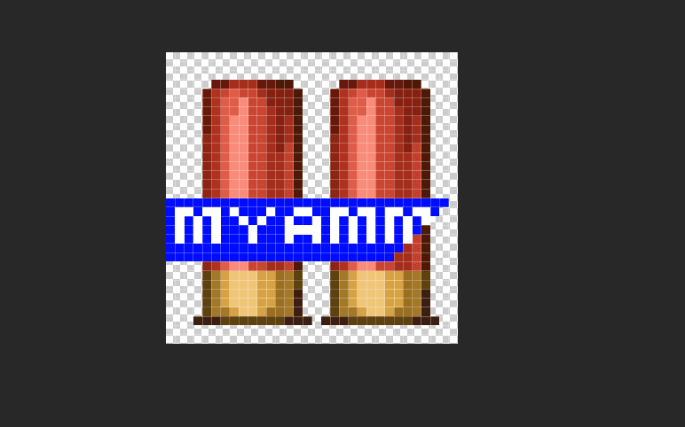
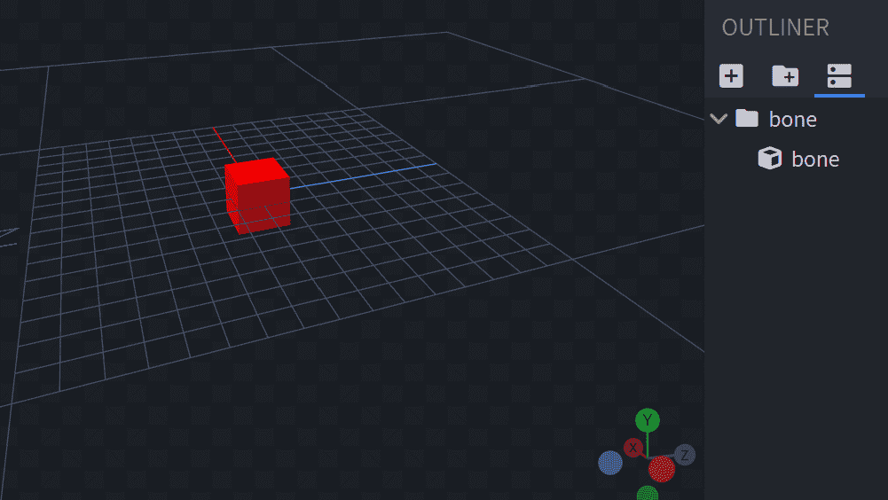
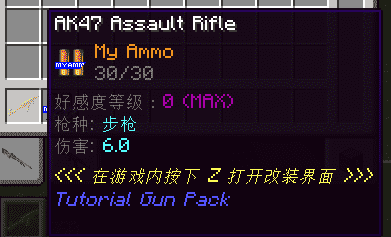
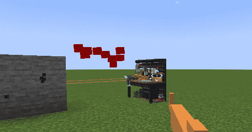

# Creating Ammunition

In the previous [Creating the First Gun](/gunpack/first_gun/) tutorial, we specified that the tutorial gun used the 7.62x39mm rifle round from the default gun pack.   
In this tutorial, we will add a custom ammunition type and have the tutorial gun use it.      
A custom ammunition might require the following models:   
- Ammo stack model, for rendering on crafting tables and display cases.
- Bullet entity model, typically used for rockets and other ammunition that need the projectile to be shown.
- Shell casing model, used for rendering ejected shells from automatic weapons.

The following textures might be needed:   
- 2D texture for backpack slots
- Ammo stack model texture
- Bullet entity model texture
- Shell casing model texture

Among these, only the 2D texture for backpack slots is mandatory.   
::: tip 
You can download the models and textures created in this tutorial from [here](https://github.com/MCModderAnchor/tacwiki/tree/main/resource/ammo).
:::

### Creating the 2D Texture for Backpack Slots (Necessary)

The texture for the ammo's backpack slot doesn't have any specific requirements; you can create a square texture as you see fit.   
Below is the texture created for this tutorial:   
   
We named it `my_ammo.png` and placed it in the `textures/ammo/slot/` directory in the gun pack.

### Creating the Ammo Stack Model (Optional)

In the default gun pack, ammo stack models are made in the form of "ammo boxes".   
   
We can follow this style.    
Below is the example created for this tutorial:   
   
Specifically, the ammo stack model supports two positioning groups: `fixed` (display case model positioning group), `thirdperson_hand` (third-person hand model positioning group), and `ground` (dropped item model positioning group).   
The placement methods and effects of these positioning groups are the same as those for gun models, which you can [see here](/gunpack/gun_positioning/).    
We export the model and name it `my_ammo_geo.json`, placing it in the `models/ammo/` directory in the gun pack.    
We save the texture as `my_ammo.png` and place it in the `textures/ammo/uv/` directory in the gun pack.    

### Creating the Bullet Entity Model (Optional)

Bullet entity models are typically used for rockets and other ammunition that need the projectile to be shown. This tutorial simply creates a bullet entity model for demonstration purposes. If you don't need it, you can skip this step.   
   
::: tip
Generally, the origin (0, 0, 0) should be the center point of the bullet entity model, and the model's Pivot Point should be at (0, 0, 0).
:::
We export the model and name it `my_ammo_entity_geo.json`, placing it in the `models/ammo_entity/` directory in the gun pack.   
We save the texture as `my_ammo_entity.png` and place it in the `textures/ammo_entity/` directory in the gun pack.    

### Creating the Shell Casing Model (Optional)

Shell casing models are used for rendering ejected shells from automatic weapons. If you don't need it, you can skip this step.   
   
::: tip
Generally, the origin (0, 0, 0) should be the center point of the shell casing model, and the model's Pivot Point should be at (0, 0, 0).
:::
We export the model and name it `my_ammo_shell.json`, placing it in the `models/shell/` directory in the gun pack.   
We save the texture as `my_ammo_shell.png` and place it in the `textures/shell/` directory in the gun pack.    

After completing all the above steps, your gun pack file structure should look like this:   
```
tutorial_gun_pack
└─ tutorial
   ├─ pack.json
   ├─ textures
   │  ├─ shell
   │  │  └─ my_ammo_shell.png
   │  ├─ gun
   │  ├─ ammo_entity
   │  │  └─ my_ammo_entity.png
   │  └─ ammo
   │     ├─ uv
   │     │  └─ my_ammo.png
   │     └─ slot
   │        └─ my_ammo.png
   ├─ sounds
   ├─ models
   │  ├─ shell
   │  │  └─ my_ammo_shell.json
   │  ├─ gun
   │  ├─ ammo_entity
   │  │  └─ my_ammo_entity_geo.json
   │  └─ ammo
   │     └─ my_ammo_geo.json
   ├─ lang
   └─ guns
```

### Creating the Ammo Display File (Required)

The ammo display file is located in the `ammo/display/` directory. Next, we create a `my_ammo_display.json` file and place it there.   
In the `my_ammo_display.json` file, add the following content:   
```json
{
  // Ammo stack model
  "model": "tutorial:ammo/my_ammo_geo",
  // Ammo stack model texture
  "texture": "tutorial:ammo/uv/my_ammo",
  // Backpack 2D texture
  "slot": "tutorial:ammo/slot/my_ammo",
  // Shell model and texture
  "shell": {
    "model": "tutorial:shell/my_ammo_shell",
    "texture": "tutorial:shell/my_ammo_shell"
  },
  // Bullet entity model and texture
  "entity": {
    "model": "tutorial:ammo_entity/my_ammo_entity_geo",
    "texture": "tutorial:ammo_entity/my_ammo_entity"
  }
}

```
### Creating the Ammo Definition File (Required)
The ammo definition file is located in the ammo/index/ directory. The file name is the ID of the ammo. Next, we create a my_ammo.json file and place it there.
In the my_ammo.json file, add the following content:
``` json
{
  // Display name of the ammo, which can be defined in the language file
  "name": "tutorial.ammo.my_ammo.name",
  // Specify the display file we created above
  "display": "tutorial:my_ammo_display",
  // Maximum stack size of the ammo
  "stack_size": 60
}
```
Add the ammo's display name definition in the language file lang/en_us.json.
``` json
  "tutorial.ammo.my_ammo.name": "My Ammo"
```
### Using the New Ammo
Previously, our tutorial gun used the 7.62x39mm rifle round provided by the default gun pack. Next, we will use the new ammo type defined above and check its effect in the game.
Change the "ammo" property in guns/data/ak47_data.json to:
``` json
  "ammo": "tutorial:my_ammo"
```
To view the bullet entity, we can temporarily slow down the bullet speed for observation. Change the "speed" property in the "bullet" attribute to:
``` json
  ...
  "bullet': {
    ...
    "speed": 1,
    ...
  },
  ...
```
We will not implement shell ejection for now, as it requires some complex modifications, which we will cover in later chapters.
Next, enter the game and check your results.
   
   