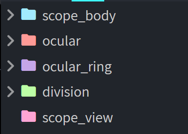
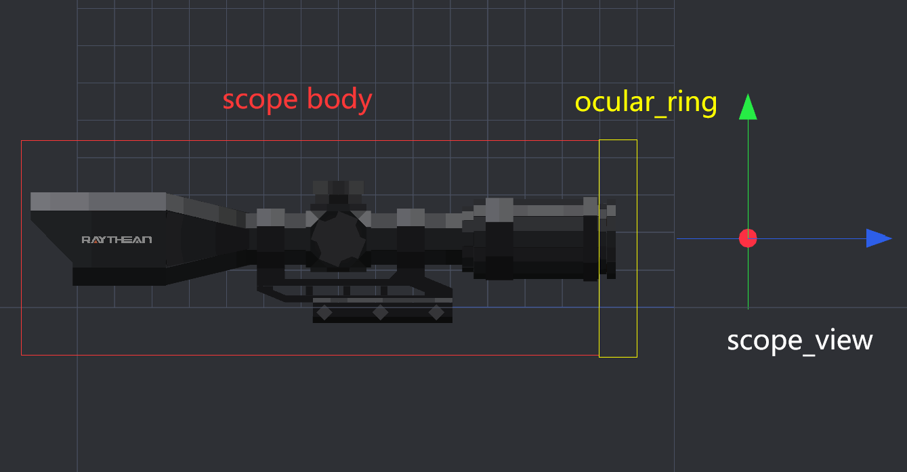
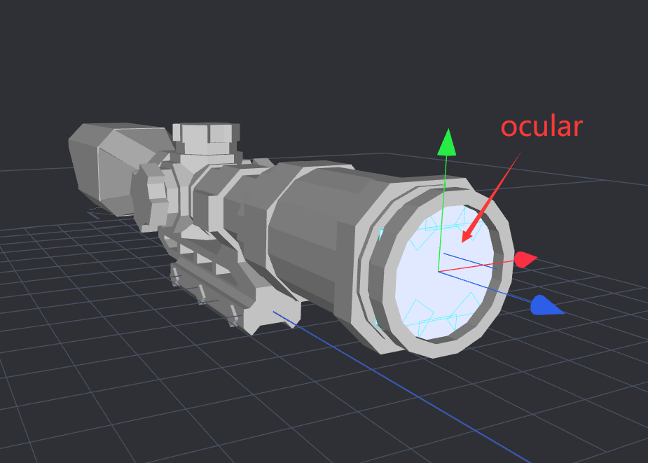
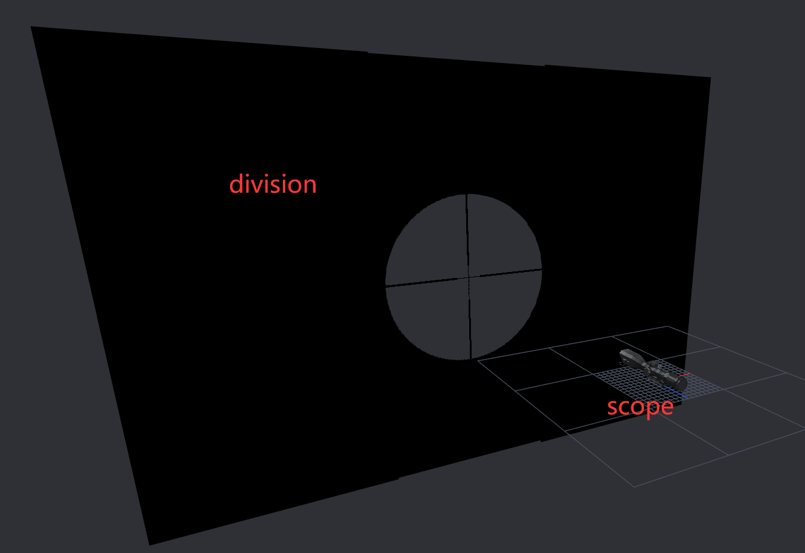
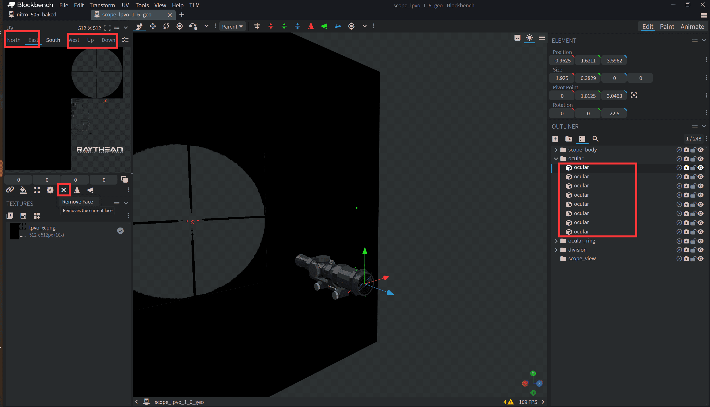
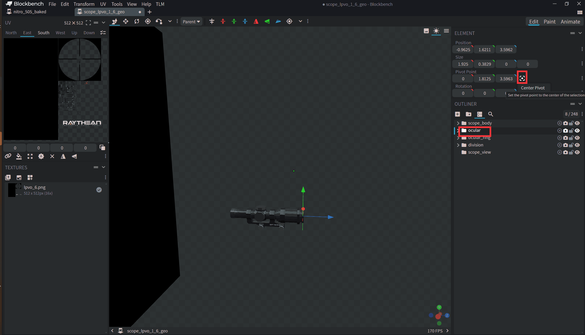
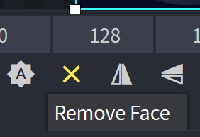

# Adding Attachments
We will use the "Pistol Silencer" as an example to demonstrate how to create an attachment and add it to your gun pack.

### Scope Attachments
1. Create a scope model. Note that the scale of the scope needs to be consistent with the firearm. The scope, like the firearm model, should face north and be positioned along the Z-axis.
::: tip
When rendering attachments in the game, the mesh center of the project file, i.e., the coordinate position (0,0,0), is rendered to the position of the attachment positioning group in the firearm model project file; different attachment models have different position requirements (note the orientation facing north).
:::
2. In the scope model, the main groups are divided into:  
**scope body**, which is the main exterior part of the scope;  
**ocular ring**, used for magnifying scopes, rendered as the scope border when aiming;  
**ocular**, used for magnifying scopes, as the lens of the field of view inside the scope;  
**division**, meaning reticle, is the image plane of the field of view inside the scope;  
**scope_view**, the camera position when aiming.
  
  
  
   
3. Face Culling and Pivot Centering: 
**All blocks within the ocular** group need to cull all faces except for the south face.  

**All groups** need to have their pivot points centered, i.e., ensure the pivot point is at the exact center of the field of view when aiming.  

::: tip
You can add a camera to the scope_view group and set the preview FOV to 70 to preview the field of view in the game.  
  
Typically, the area of the division, the relative distance of the scope view positioning group, and the model are not fixed and are adjusted based on actual game experience.  
The block used for the division texture needs to retain only the south face. You can use the UV toolbar's [Remove Face] to cull unnecessary faces.  
  
If your division texture needs to have a glowing reticle effect, you can create a subgroup ending with **_illuminated** for the texture block of the reticle.  
The length and thickness of the ocular_ring are recommended to be thinner to reduce the wide-angle distortion effect at close distances to the camera.
:::

### Other Attachments
1. Similar to the requirements for firearm models, we need to create an attachment model according to the Bedrock Edition requirements. Pay attention to the spatial position of the model in the project file.  

   
The subsequent export steps are the same as the steps in [Creating the First Gun](/gunpack/first_gun/), which you can refer to for guidance.

### Preparation
Make sure you have the following materials ready (here I use "silencer" as the registration name for this attachment; actual names need to be more detailed to avoid duplication):
- Model file: silencer_geo.json
- Model texture: silencer.png
- Backpack 2D texture: silencer.png    
1. Follow the steps in [Creating the First Gun Pack](/gunpack/first_gunpack/) to create the gun pack directory.
2. The attachment model should be placed in the models/ directory of the gun pack. We can create a subdirectory models/attachment/ to categorize the attachment models. Place the model file in this directory.
3. The texture files should be placed in the textures/ directory of the gun pack. Similarly, we create a subdirectory textures/attachment/ to categorize the attachment textures. Create uv and slot folders in this directory to store the model textures and backpack 2D textures, respectively. Place the model texture in the textures/attachment/uv/ directory and the backpack 2D texture in the textures/attachment/slot/ directory.

If you follow the above steps, you will end up with the following directory structure:

```
tutorial_gun_pack
└─ tutorial
   ├─ pack.json
   ├─ textures
   │  └─ attachment
   │     ├─ uv
   │     │  └─ silencer.png
   │     └─ slot
   │        └─ silencer.png
   ├─ models
   │  └─ attachment
   │     └─ silencer_geo.json
   └─ lang
      └─ en_us.json
```

### Creating Attachment Data File
The attachment definition file should be placed in the attachments/data/ directory. This file defines various properties of the attachment. Next, we create a basic data file for the "Pistol Silencer".   
Create the file attachments/data/silencer_data.json 
``` json
{
  // Attachment weight, in kg. Affects the movement speed of the holder
  "weight": 0.2,
  // Effect on aiming time, additive, in seconds, can be negative
  "ads_addend": 0.02,
  // Effect on accuracy, additive, can be negative. Negative means increased accuracy, positive means decreased accuracy.
  "inaccuracy_addend": -0.1,
  "silence": {
    // Sound propagation range. If the default is 50 blocks, enter -10 here, then the propagation distance after silencing is 40 blocks
    "distance_addend": -10,
    // Whether to use a dedicated silenced sound source
    "use_silence_sound": true
  },
  // Effect on gun recoil
  "recoil_modifier": {
    // Vertical deflection reduction, range -1~0
    "pitch": -0.05,
    // Horizontal deflection reduction, range -1~0
    "yaw": -0.03
  }
}

```
### Creating Attachment Display File
The attachment display file should be placed in the attachments/display/ directory. This file defines the display effects of the attachment, such as models, textures, animations, etc. Next, we create a basic display file for the "Pistol Silencer".
Create the file attachments/display/silencer_display.json
``` json
{
  // Use the backpack 2D texture we put in: textures/attachment/slot/silencer.png. Note, do not include the file suffix, and do not include the leading "textures/"
  "slot": "tutorial:attachment/slot/silencer",
  // Use the model file we put in: models/gun/silencer_geo.json. Note, do not include the file suffix, and do not include the leading "models/"
  "model": "tutorial:attachment/silencer_geo",
  // Use the model texture we put in: textures/attachment/uv/silencer.png. Note, do not include the file suffix, and do not include the leading "textures/"
  "texture": "tutorial:attachment/uv/silencer",
  // The following are properties that only "scope" type attachments need to set.
  // Players can switch between the magnifications set in the array (initially 4.0x magnification)
  "zoom": [
    4.0,
    8.0
  ],
  // If the attachment is a scope and is a tubular magnifying scope, this option should be true
  "scope": false,
  // If the attachment is a scope and is a red dot or holographic sight, this option should be true
  "sight": true,
  // The FOV rendered by the gun and scope when aiming. By default, the FOV for rendering hand models in MC is 70
  "fov": 70.0
  // sound effects, which can only be heard when installing and removing accessories
  "sounds": {
    // Sound effect when installing.
    "install": "tacz:attachments/scope_general_e",
    // Sound effect when removing.
    "uninstall": "tacz:attachments/scope_general_e"
  }
}

```
### Creating Attachment Index File
The attachment index file should be placed in the attachments/index/ directory. This file defines the attachment item and indexes the data file and display file. Note that the name of this file is the ID of your attachment item, which is the unique identifier for the attachment item. Next, we create a basic index file for the "Pistol Silencer".
Create the file attachments/index/silencer.json
``` json
{
  // The display name of the attachment, supports using language files for definition
  "name": "tutorial.attachment.silencer.name",
  // The display file of the attachment corresponds to attachments/display/silencer_display.json. The prefix "attachments/display/" and the suffix ".json" do not need to be included
  "display": "tutorial:silencer_display",
  // The data file of the attachment corresponds to attachments/data/silencer_data.json. The prefix "attachments/data/" and the suffix ".json" do not need to be included
  "data": "tutorial:silencer_data",
  // The category of the creative tab, since we are creating a muzzle attachment, the type is selected as muzzle
  "type": "muzzle"
}

```
Define the display name of the attachment in the language file. Add to lang/en_us.json:
``` json
    "tutorial.attachment.silencer.name": "Pistol Silencer"
```

### Creating Attachment Support Files
To enable the newly created attachment to be installed on the corresponding firearm, please set the corresponding tags file according to the following documentation:
#### Exclusive Attachments
If you want your newly created attachment to be used only on a specific gun:
1. Create a folder named tags/attachments/allow_attachments in the tutorial_gun_pack/tutorial/ directory.
2. For example, if you want the AK-47 to only support the scope "scope_re", create a JSON file named ak47.json in the allow_attachments folder and fill in the following code:
``` json
[
  // "tutorial" is the gun pack where the custom scope is located, and "scope_re" is the scope name
  "tutorial:scope_re"
]

```
#### Universal Attachments
If you want all guns that support scopes to be able to use the scope_re scope you created, refer to the following documentation:
1. Create the folder tacz\custom\tacz_default_gun\tacz\tags\attachments in the tutorial_gun_pack directory.
2. Create a file named scope.json in the attachments folder and fill in the following code:
``` json
[
  "tutorial:scope_re"
]
```


### Verify Your Results
After the above steps, your gun pack directory structure should look like this:
```
tutorial_gun_pack
└─ tutorial
   ├─ pack.json
   ├─ textures
   │  └─ attachment
   │     ├─ uv
   │     │  └─ silencer.png
   │     └─ slot
   │        └─ silencer.png
   ├─ models
   │  └─ attachment
   │     └─ silencer_geo.json
   ├─ lang
   │  └─ en_us.json
   └─ attachments
      ├─ index
      │  └─ silencer.json
      ├─ display
      │  └─ silencer_display.json
      └─ data
         └─ silencer_data.json
```
Copy the created gun pack folder to the config/tac/custom/ folder in the root directory of the Minecraft client version, then start the game.
::: tip
It should be noted that the attachment items need to be used together with the positioning group of the firearm. For the creation and use of the positioning group, please refer to the tutorial content in [Gun Model Positioning Group.](/gunpack/gun_positioning/).
:::
