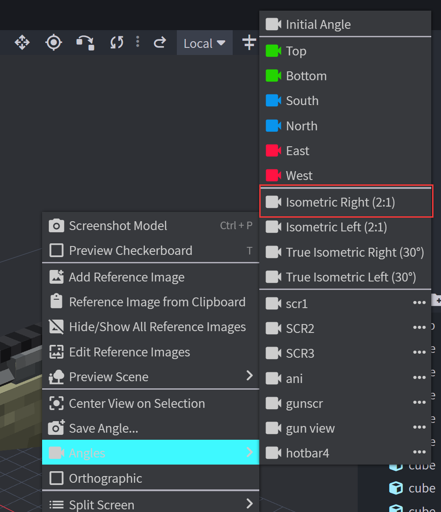
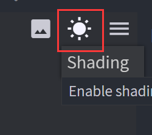
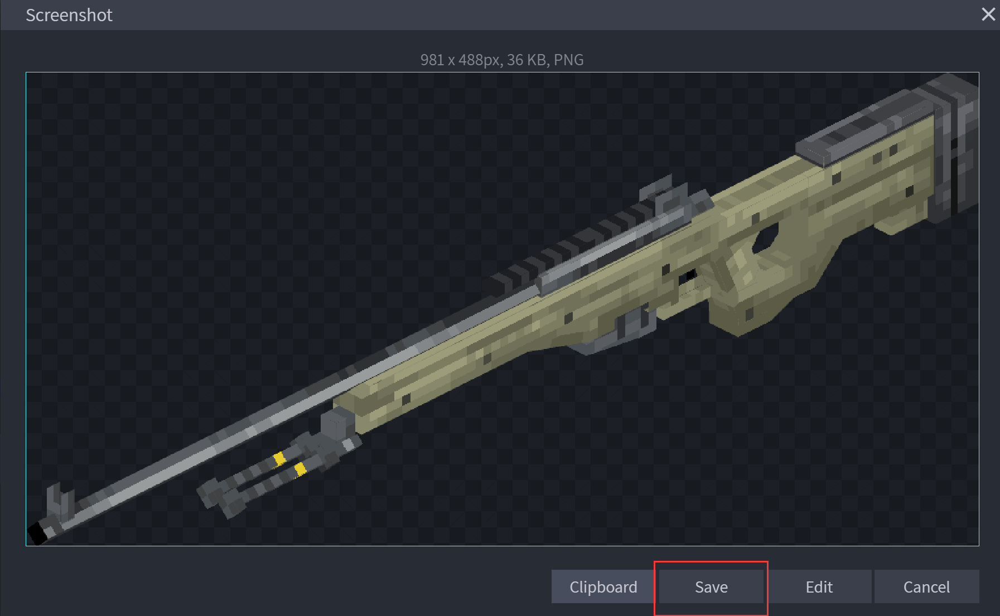
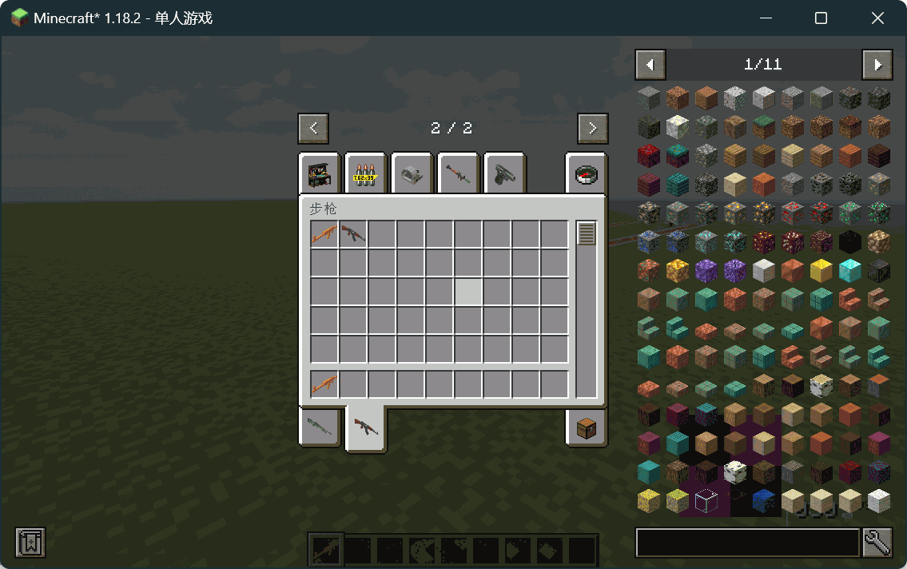

# Creating the First Gun
We will use the ak47 as an example to show how to create the simplest gun and add it to your gun pack.
### Creating the gun model
Let's start by creating a simple model for the tutorial   
::: tip
Note that if you wish to create a detailed and complex gun model, it is recommended you check out our [model workflow guide](/model_guide/)   
:::

1. First, create a new Bedrock Edition entity model.   
   
2. Then, finish modeling the gun and texture    
    
3. Finally, export the Bedrock Edition model.
    
Don't forget to save the texture file as well.
4. You can use the Screenshot Model function of BlockBench to generate a texture for inventory GUIs.
When creating the texture for inventory GUIs it is recommended to do the following:<br/>
#1 Right-Click the block bench workspace interface.<br/>
#2 Select the isometric view right (2:1)<br/>
#3 Turn off the shadow shading in blockbench<br/>
    
  
  

Note that the textures generated by this method are non-rectangular, and you will need to scale or crop them using a image editing software. For images displayed in GUIs the recommended resoultion is **32x32 Pixels**。  

### Preparation
Make sure you have the following files ready:   
- Model File: ak47_geo.json    
- Model Texture: ak47.png    
- Inventory display texture: ak47.png    
::: tip
If you are too lazy to do it yourself, you can go [here](https://github.com/MCModderAnchor/tacwiki/tree/main/resource/first_gun) to download already made assets.
:::
1. Follow the steps in [Creating your first gun pack](/gunpack/first_gunpack/) to create a gun pack directory.
2. Gun models should be placed in the 'models/' directory of the gun pack. In here we can create a subdirectory named 'models/gun/' to classify gun models, and put the model file in this directory
3. Texture files should be placed in 'textures/directory of the gun pack. Like before we create a subdirectory 'textures/gun/' to classify gun textures. In this directory, create uv and slot folders to store model textures and Inventory (slot) textures respectively. We put model textures in the 'textures/gun/uv/ directory and inventory textures in the 'textures/gun/slot/' directory.

If you follow the steps listed above, you will end up with the following directory structure below.    
```
tutorial_gun_pack
└─ tutorial
   ├─ pack.json
   ├─ textures
   │  └─ gun
   │     ├─ uv
   │     │  └─ ak47.png
   │     └─ slot
   │        └─ ak47.png
   ├─ models
   │  └─ gun
   │     └─ ak47_geo.json
   └─ lang
      └─ en_us.json
```
### Creating a gun data file
The gun data file should be placed in the 'guns/data/' direcotry. This file is used to define the properties of the gun, such as damage, ammunition capacity, rate of fire, etc. Next, we create a basic data file for ak47. Create the file 'guns/data/ak47._data.json'
``` json
{
  // Specify the guns and ammunition, we use the 7.62x39mm ammo type in the default gun pack.
  "ammo": "tac:762x39",
  // Max ammo
  "ammo_amount": 30,
  // Type type.Here we fill in the closed_bolt according to the type of AK47, and then explain it in detail later.
  "bolt": "closed_bolt",
  // Empty ammunition per minute, the maximum should not exceed 1200
  "rpm": 600,
  // Bullet attribute
  "bullet": {
    // The life time of the bullet in seconds
    "life": 10,
    // damgage the bullet does
    "damage": 6,
    // The speed of the bullet M/s
    "speed": 400,
    // Bullet Gravity
    "gravity": 0,
    // Knockback
    "knockback": 0,
    // Fly resistance
    "friction": 0.01,
    // Whether to ignite the target
    "ignite": false,
    // The maximum number of penetrating entities
    "pierce": 2
    // Explosive parameters, used for explosive weapons such as RPG, if not filled in, the warhead will not explode
    //"explosion": {
    //  "radius": 5
    //}
  },
  // Changing parameters
  "reload": {
    // Fill in Magazine here, and the details are explained in the future.
    "type": "magazine",
    // The time of the magazine supply bomb is completed. At this point, the server will update the number of bullets in the gun
    // Corresponding to the moment when the magazine is inserted in the animation.
    "feed": {
      // Empty chamber shift
      "empty": 2.25,
      // Tactical shift
      "tactical": 1.55
    },
    // The magazine supply is long (second). At this point, the firearms can be opened and viewed.
    // It usually corresponds to the moment when the guns are returning to the original in the animation.
    "cooldown": {
      // Empty chamber shift
      "empty": 2.6,
      // Tactical shift
      "tactical": 2.0
    }
  },
  // Takeout time/ Weapon draw time
  "draw_time": 0.35,
  // Holstering time
  "put_away_time": 0.4,
  // Ads speed unit in seconds
  "aim_time": 0.2,
  // Time till sprint, unit in seconds
  "sprint_time": 0.3,
  // Fire mode
  "fire_mode": [
    // Fully automatic
    "auto",
    // Semi -automatic
    "semi"
  ],
  // After recoil, Pitch and Yaw need at least two key frames respectively respectively
  "recoil": {
    "pitch": [
      // Time represents the position of the keyframe on the timeline, and Value represents the range of random value.
      {"time": 0, "value": [0.7, 0.7]},
      {"time": 0.25, "value": [0.7, 0.7]},
      {"time": 0.45, "value": [-0.175, -0.175]},
      {"time": 0.6, "value": [0, 0]}
    ],
    "yaw": [
      {"time": 0, "value": [-0.35, -0.15]},
      {"time": 0.25, "value": [-0.35, -0.15]},
      {"time": 0.45, "value": [0, 0]}
    ]
  },
  // Bullet inaccuracy
  "inaccuracy": {
    // Standing shooting
    "stand": 2,
    // Move shooting
    "move": 4,
    // Sneak shooting
    "sneak": 1,
    // Lying down and scattered
    "lie": 0.5,
    // Aiming accuracy
    "aim": 0.2
  }
}
```
### Creating a gun display file
The gun display file should be placed in the 'guns/display/' directory. This file is used to define the display effect of the gun, such as model, texture, animation etc.
``` json
{
    // Use the model file we put in: Models/Gun/AK47_ge.json.Note that there is no need to include file suffix, nor "Models/" at the beginning.
    "model": "tutorial:gun/ak47_geo",
    // Use the model we put in: Textures/Gun/UV/AK47.PNG.Note that there is no need to include file suffix, nor "textures/" at the beginning.
    "texture": "tutorial:gun/uv/ak47",
    // Use the inventory png we put in: Textures/Gun/Slot/AK47.PNG.Note that there is no need to include file suffix, nor "textures/" at the beginning.
    "slot": "tutorial:gun/slot/ak47",
    // The third person holds the gun animation, fills directly into the default
    "third_person_animation": "default"
}
```
### Create a gun definition file
The gun definition file should be placed in the 'guns/index' directory. This file is used to define the gun item and index it to the data file and display file. It should be noted that the name of this file is the id of your gun, which is the unique identifier of the gun item. Next, we will create a basic definition file for ak47.
Create the file 'guns/index/ak47.json'
``` json
{
    // The display name of the firearm supports whats defined in the language files.
    "name": "tutorial.gun.ak47.name",
    // The display file of the firearm corresponds to the GUNS/Display/AK47_DISPLAY.JSON, where the prefix "Gus/Display/" and the suffix ".json" does not need to be included.
    "display": "tutorial:ak47_display",
    // The firearm data file corresponds to the guns/data/ak47_data.json, of which the prefix "guns/data/" and suffix ".json" does not need to be included.
    "data": "tutorial:ak47_data",
    // Types of firearms are used to create label bar.
    // All available categories: Pistol (pistol) SNIPER (sniper) Rifle (rifle) Shotgun (shotgun) SMG (submachine gun)
    //             MG (machine gun) RPG (rocket launcher)
    "type": "rifle",
    // Types of firearms, determine the logic of firearms, such as fire, loading, etc., the default is Modern_kinetic
    "item_type": "modern_kinetic",
    // The number of sorting determines the order in the creation mode tab
    // The smaller the number, the higher the priority
    "sort": 10
}
```
Define the display name of the gun in the language file. Add to 'lang/en_us.json' the following line
``` json
    "tutorial.gun.ak47.name": "AK47 Assult Rifle"
```
### Testing your gun
After the above steps, your gun pack directory structure should be like the following.  
```
tutorial_gun_pack
└─ tutorial
   ├─ pack.json
   ├─ textures
   │  └─ gun
   │     ├─ uv
   │     │  └─ ak47.png
   │     └─ slot
   │        └─ ak47.png
   ├─ models
   │  └─ gun
   │     └─ ak47_geo.json
   ├─ lang
   │  └─ en_us.json
   └─ guns
      ├─ index
      │  └─ ak47.json
      ├─ display
      │  └─ ak47_display.json
      └─ data
         └─ ak47_data.json
```
Copy the created gun pack folder to the 'config/tac/custom/' of your minecraft instance
If you see the following screen, it proves that the gun has been added successfully.
    
You may notice that the gun isn't position correctly to the player holding the gun. This is because the gun model has not yet been assigned a model positioning group for each player. We will proceed to explain how to use [the gun model position group](/gunpack/gun_positioning/)。