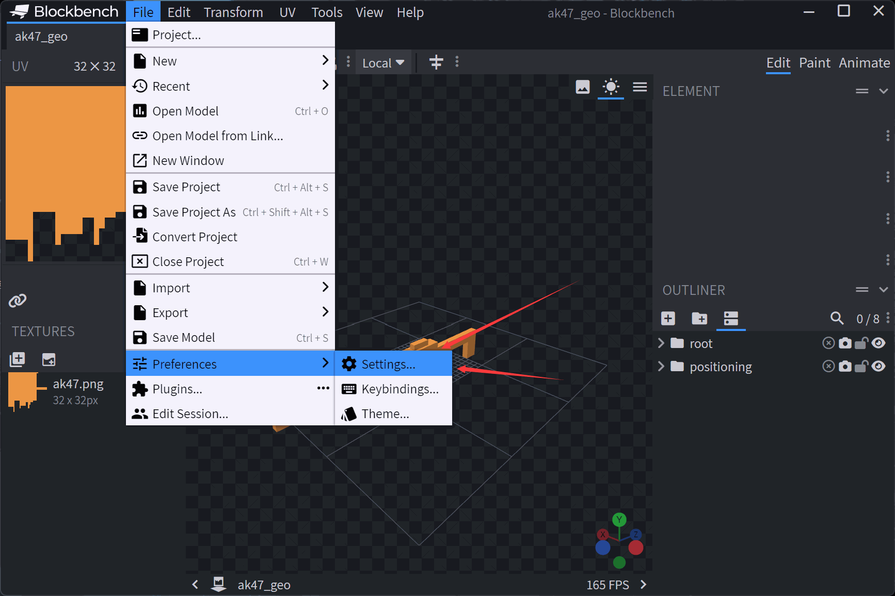
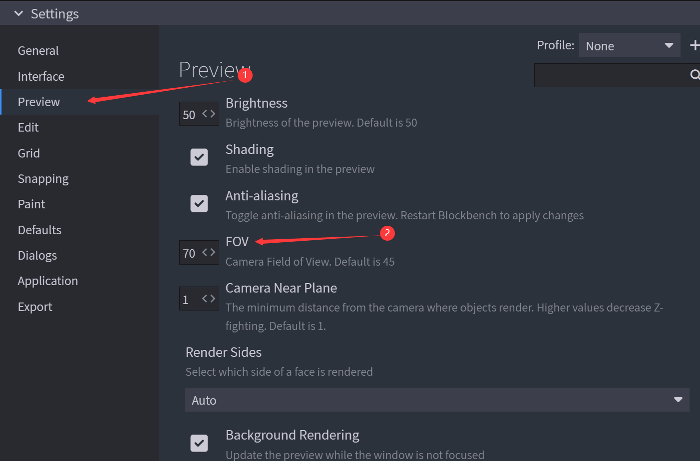
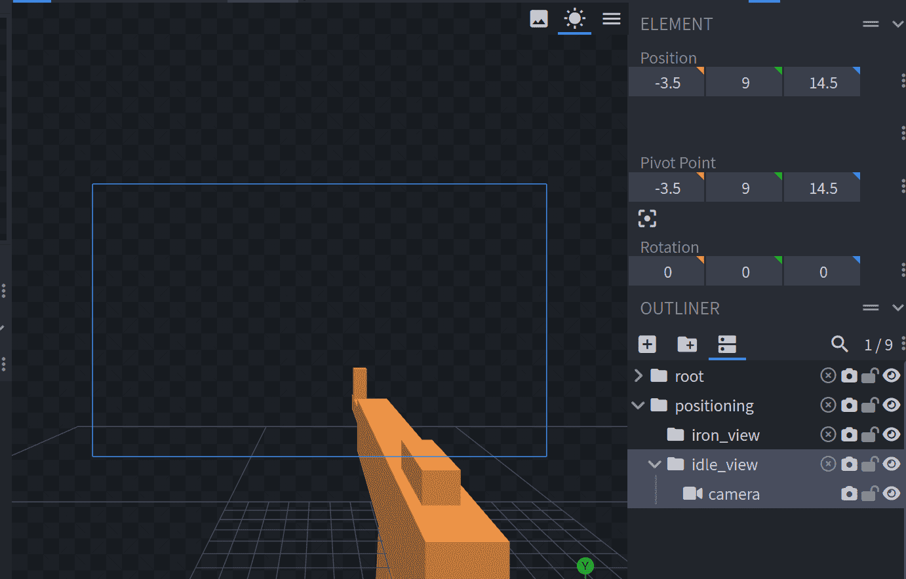
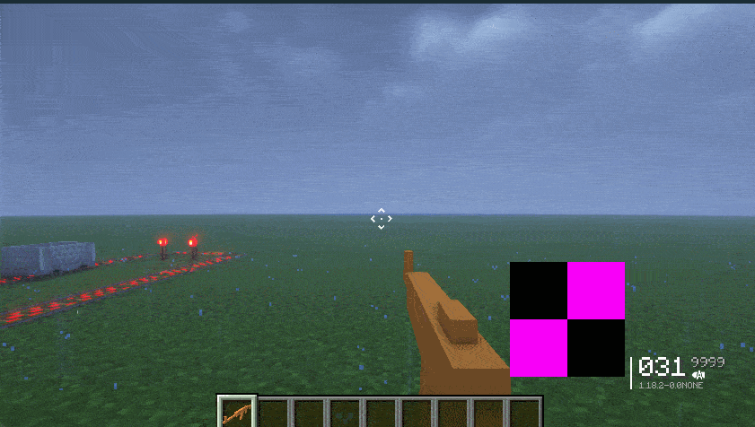
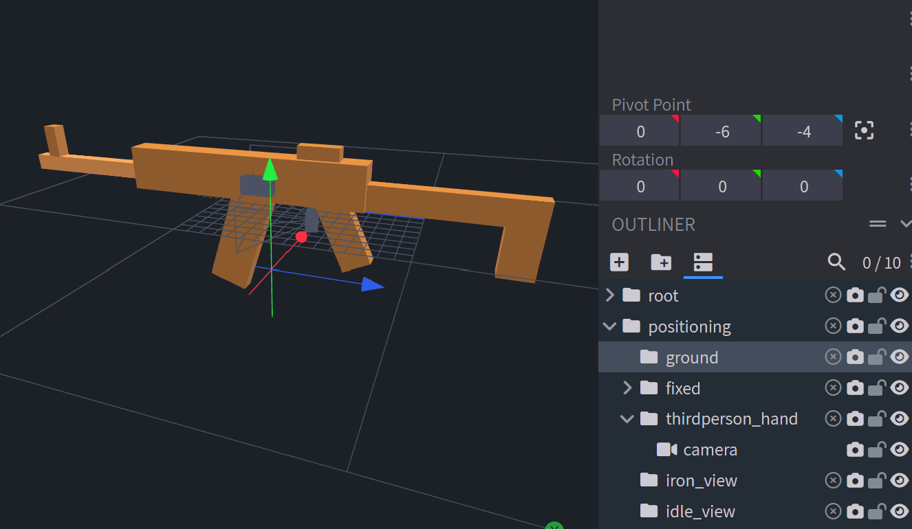

# Adjusting the gun model positioning group
For any gun model, you need to place five positiong groups for them: iron_view, idle_view, ground, thirdperson_hand, and fixed. They should only be used for model positioning, so the models contained in them will not actually be rendered. Next we will demonstrate how to create and adjust these positioning groups.
### Install the cameras plugin for BlockBench
The adjustment of the model positiong group requires the camera plugin.
You can get it from [here](https://github.com/JannisX11/blockbench-plugins/blob/master/plugins/cameras.js) Download the cameras plugin. Follow the steps below to install cameras to your BlockBench workspace.
   
   
### Changing BlockBench's FOV settings
Before you start adjusting the first person prespective, you need to make sure your BlockBench preview FOV is 70. This is because the default FOV for a First Person Perspective is 70.
   
   
### Adjust first person camera positioning group
First, to make the model grouping neat, we can create a group called positioning (you can decide the name of this group) to store various model positioning groups.
Next, create two new groups in position, named 'iron_view' and 'idle_view' (the names of these two groups cannot be changed). They are the positioning group for the iron sight view and the positioning group for the normal grip view.
::: tip
'iron_view' is the position and orientation of the player's eyes when the player is aiming down sights with iron/default sites
'idle_view' is the position and orientation of the player's eyes wjem the player is not in ADS (Aim Down Sight)
:::
In order to preview the effect of the camera positioning group, we need to add a camera to the positioning group. Select the positioning group to which you want to add a camera and add the camera as follows.
   
Next, drag the positioning group to the appropriate position.   
::: warning
Please make sure that when dragging you have selected the positioning group itself and not the camera inside the group. When dragging the positioning group, the Positiong value and Pivot Point value in the parameter display in the upper right corner should change at the same time.
:::
   
You then can bind the view to the camera at any time for preview  
   
We use the same method to place idle_view  
   
Finally, export the model file, start the game, and you should see an effect similar to the following gif. 
   
### Adjusting the third person model positioning group
Create three new groups in position, named 'ground', 'thirdperson_hand', and 'fixed'.
- ground group should be located directly below the gun model in Block Bench space
- thirdperson_hand should be located on the gun model's grip or trigger, towards the front of the gun. The y-axis can be rotated an additional fifteen degrees in the positive direction (since the player's hand model is not completely parallel to the line of sight).
- fixed should be centered on the gun model, towards the side of the gun
::: tip
You can add cameras to these positioning groups to see where they are facing.
:::
The following shows the three positioning groups of the tutorial gun
   
   
   
If you place the positioning groups correctly, you should see something similar as shown in the following picture   

You can also change the scaling factor of the gun model in these three situations in the effects file.
Add the following code to 'guns/display/ak47.display.json'.
``` json
    "transform": {
        "scale": {
            // Third person hand Position
            "thirdperson": [
                0.6,
                0.6,
                0.6
            ],
            // Ground
            "ground": [
                0.6,
                0.6,
                0.6
            ],
            // display
            "fixed": [
                1.0,
                1.0,
                1.0
            ]
        }
    },
```
Your ak47_display.json should look like this:
``` json
{
    "model": "tutorial:gun/ak47_geo",
    "texture": "tutorial:gun/uv/ak47",
    "slot": "tutorial:gun/slot/ak47",
    "transform": {
        "scale": {
            "thirdperson": [
                0.6,
                0.6,
                0.6
            ],
            "ground": [
                0.6,
                0.6,
                0.6
            ],
            "fixed": [
                1.0,
                1.0,
                1.0
            ]
        }
    },
    "third_person_animation": "default"
}
``` 