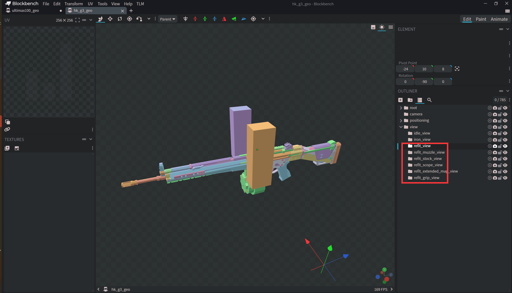
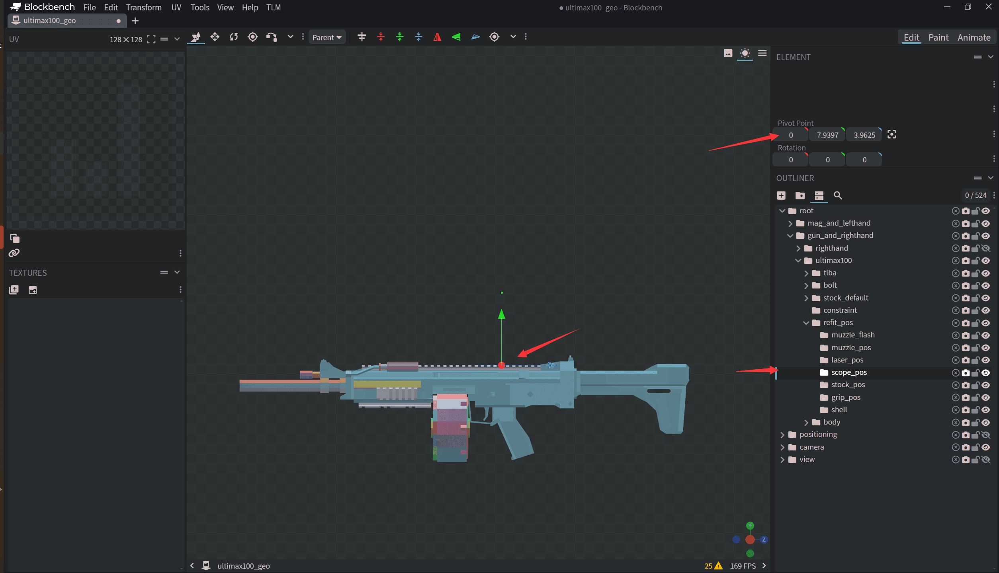

# Gun Modifications Support
This tutorial is authored by Lesraisins-Earl   
[[toc]]

## Gun Model Groups Affected by Attachments

> In the gun model, if a group is named one of the following, it will be affected by attachments.

**Default Attachments**: xxx_default  
Rendered when no attachments are installed, where xxx is replaced with specific attachment types: scope, grip, stock, muzzle, laser, extended_mag  
**Default Iron Sight**: sight  
Rendered when no scopes are installed  
**Default and Tactical Handguard**: handguard_default/handguard_tactical  
Rendered when no grip attachments are installed: handguard_default  
Rendered when any grip attachment is installed: handguard_tactical  
**Mount**: mount  
Rendered when any scope is installed  

## Setting Up Positioning Groups
### Assembly Interface Camera Positioning Group
> In-game, press [Z] while holding the gun to open the assembly interface


Below are all the camera positioning groups for the gun model in the assembly interface. You can add cameras for them in Blockbench for previewing.

**Overview**: refit_view  
**Muzzle**: refit_muzzle_view  
**Stock**: refit_stock_view  
**Scope**: refit_scope_view  
**Magazine**: refit_extended_mag_view    
**Grip**: refit_grip_view  
**Laser**: refit_laser_view  


### Model Positioning Groups
> To ensure gun attachments render in the correct position on the gun, we need to add positioning groups in the gun model.

1. Select the required positioning group, create them in the appropriate subgroup, and ensure they are influenced by the gun's animation. Below are the names of the supported attachment positioning groups:

   **Muzzle**: muzzle_pos  
   **Laser**: laser_pos  
   **Scope**: scope_pos  
   **Stock**: stock_pos  
   **Grip**: grip_pos   

2. Move the attachment positioning group to the corresponding position on the gun. The example below shows **scope_pos**. Generally, the positioning group should be placed on the contact surface of the rail.




### Magazine and Extended Magazines

If you need to use extended magazines, you **must** create a **magazine** group and place both standard and extended magazine groups inside it; otherwise, the magazine will not render correctly.  

The standard magazine model group should be named: **mag_standard**.  

Extended magazine models from level 1 to 3 should be named: **mag_extended_1** to **mag_extended_3**.  


## Enabling Attachment Slots
Open the gun data file namespace/gun/data/xxx_data.json

Add the following code to specify the attachments the gun supports.
```json
  // Open attachment slots. Unspecified slots are closed by default. All attachment slot types are:
  // scope, stock, muzzle, grip, laser, extended_mag
  "allow_attachment_types": [
    "scope",
    "stock",
    "muzzle",
    "grip",
    "laser",
    "extended_mag"
  ]
```

If the weapon supports extended magazines, add the following code to specify the total ammo count for different levels of extended magazines.
``` json
    // Total ammo count for extended magazines
  "extended_mag_ammo_amount": [
    45,
    70,
    100
  ]

```

## Changing Attachment Tags
>Currently, tacz uses a tag system to specify which attachments a weapon supports.

### Using Universal Attachments
1. In the **namespace directory** of the gun pack, create a folder named tags/attachments/allow_attachments.
2. In this folder, create a file '{your_gun_name}.json' (e.g., ak47.json).

3. Open the file and list the supported attachment types.
``` json
[
    "#tacz:scope",
    "#tacz:muzzle",
    "#tacz:extended_mag",
    "#tacz:stock",
    "#tacz:grip",
    "#tacz:laser"
]
```
>Entries starting with '#' are treated as tags. The tacz tag system is similar to the vanilla system and can include other tags. If so, the former will include all contents of the latter.

### Specifying Specific Attachments
1. Open the tag file corresponding to the gun in tags/attachments/allow_attachments.
2. Directly specify the attachment IDs. The example below specifies the SRO Dot from the default gun pack.
``` json
[
    "tacz:sro_dot"
]
```

### Creating Custom Attachment Tags

> Any JSON file in the tags/ folder will be loaded as a tag.

1. In the tags/attachments/ folder, create a file '{tag_name}.json' (e.g., my_grips.json).
2. Add entries to the tag file. Note that only attachment IDs or other tags under tags/attachments/ can be used as entries.
3. Use this tag elsewhere. If your namespace is abc, the full name of def.json under tags/attachments/ is abc.

### Extending Existing Tags

Using #tacz:scope as an example.

1. Create the corresponding namespace folder in the gun pack **root directory**, in this case, tacz.
2. Create a tags folder under the new namespace.
3. Place a tag file with the same name in the same path, in this case: tacz/tags/attachments/scope.json.
4. Add the required entries to extend the tag. When tacz reads the tag, it will automatically collect entries from all tag files with the same name and path, instead of overwriting them.
