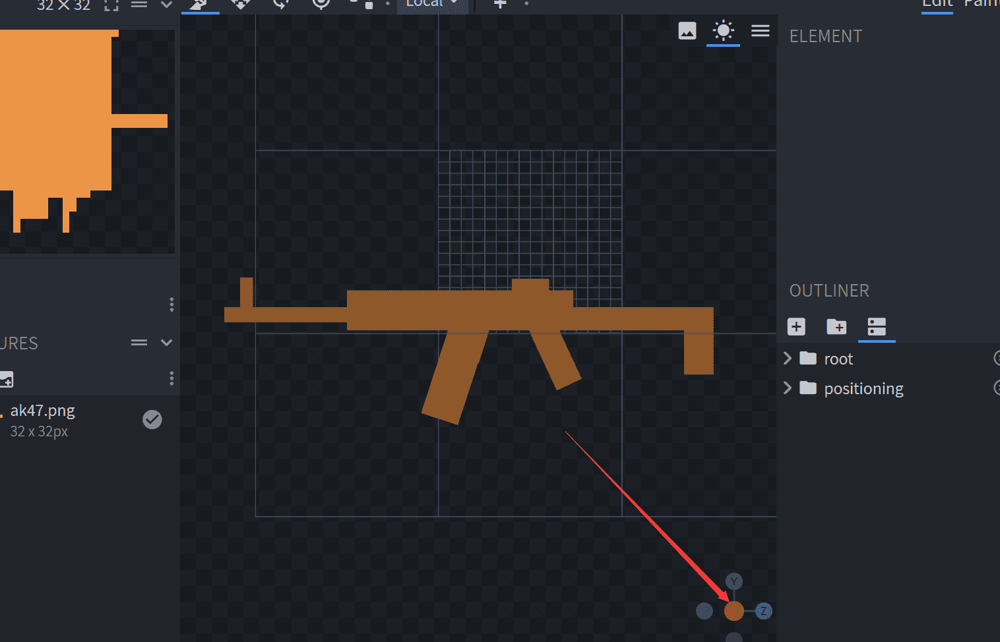
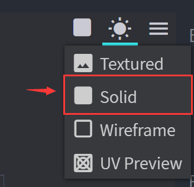
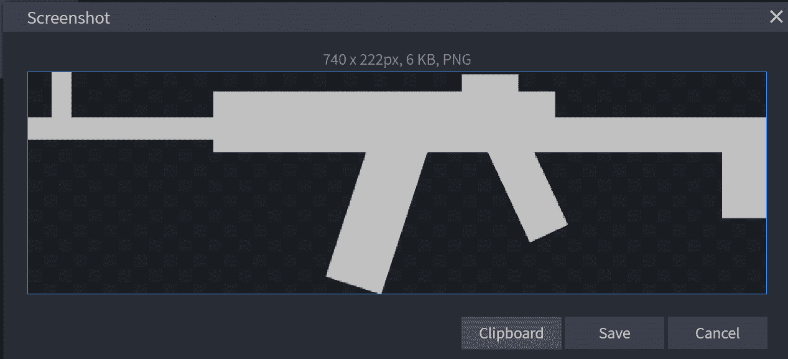
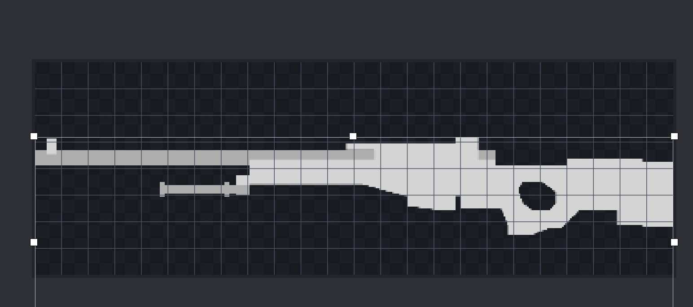

# Creating a HUD Icon for the gun
### Use the BlockBench Screenshot Model to get a side view of the gun
We can use the screenshot Model function provided by BlockBench to obtain sillouette of the gun model.
1. Use the cursor view in the lower right corner and click on the appropriate axis to get a side view of the model.  
::: tip
In the default gun pack, we usually make the muzzle in the side view facing left. This can achieve a more appealing look.
:::
  
2. Prezz z or click the icon in the upper right corner to switch the display mode of the model, so that the model is displayed as'solid'. The model will be displayed in white within the project file.    
  
3. Then Press 'Ctrl + P' to take a screenshot of the view, and then save the image as a .png.
   
  
This way we can get a pure white sideview of the gun model.
### Process the side view of the gun model as a HUD Icon
The aspect ratio of the HUD icon during rendering is 3:1. So if you don't want the side view of the gun you provided to be stretched, you should consider using a image processing tool to scale and crop the side view to get an image with an aspect ratio of 3:1.
Since the HUD Icon does not require alot of detail, we can reduce the image quality somewhat. The following are several recommended resolutions: '180 x 60', '192 x 64', and '384 x 128'. Usually the image elements are aligned to the middle axis. For example,
   
for shorter guns such as pistols, the image needs to be aligned to the right as shown in the figure below
  
If you are too lazy (Zen) to do it yourself, you can follow the link [here](https://github.com/MCModderAnchor/tacwiki/tree/main/resource/hud_icon) to get a processed image.   
Next, we put the map in the 'textures/gun/hud' directory of the gun pack and specify it in the 'guns/display/ak47_display.json' file.

At this point if you are following the Guide your file structure should look similar to the one below.
```
tutorial_gun_pack
└─ tutorial
   ├─ pack.json
   ├─ textures
   │  └─ gun
   │     ├─ uv
   │     │  └─ ak47.png
   │     ├─ slot
   │     │  └─ ak47.png
   │     └─ hud
   │        └─ ak47.png
   ├─ models
   │  └─ gun
   │     └─ ak47_geo.json
   ├─ lang
   │  └─ en_us.json
   └─ guns
      ├─ index
      │  └─ ak47.json
      ├─ display
      │  └─ ak47_display.json
      └─ data
         └─ ak47_data.json
```
Add the line to ak47_display.json
``` json
    "hud": "tutorial:gun/hud/ak47"
```
At this point your ak47 effects file should look like this:  
``` json
{
    "model": "tutorial:gun/ak47_geo",
    "texture": "tutorial:gun/uv/ak47",
    "slot": "tutorial:gun/slot/ak47",
    "hud": "tutorial:gun/hud/ak47",
    "third_person_animation": "default"
}
```
After entering the game, if you see the black and purple block originally shown in place of a HUD icon is now showing the appropriate silloute , it proves you've successfully added the HUD icon for the gun!
   
You can also try it with empty bullets. It will automatically turn red when it runs of out bullets.
   