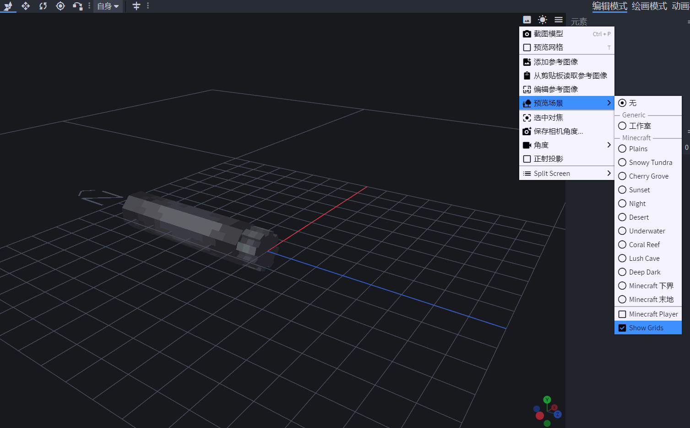

# 添加配件
我们将以「手枪消音器」为示范，展示如何创建一个配件，并将其加入你的枪包。
### 调整配件模型
1. 和枪械模型的需求一样，我们需要以基岩版为要求，创建一个配件模型。
2. 需要将场景自带的网格中心视为定位组的原点，不同的配件模型有不同的位置需求，将配件模型摆放在合适的位置（注意朝向为向北）。
   
之后的导出步骤和 [创建第一把枪](/zh/gunpack/first_gun/) 的步骤相同，可以前去查看参考。

### 准备工作
确定你已经准备好了如下材料（我这里使用「silencer」作为这个配件的注册名，实际需要更细节的命名方式防止重复）：
- 模型文件: silencer_geo.json
- 模型贴图: silencer.png
- 背包 2D 贴图: silencer.png    
1. 按照 [创建第一个枪包](/zh/gunpack/first_gunpack/) 的步骤创建枪包目录。
2. 配件模型应放入枪包的 models/ 目录下。我们可以创建一个子目录 models/attachment/ 对配件模型进行分类。并将模型文件放在此目录下。
3. 贴图文件应放入枪包的 textures/ 目录下。同理，我们创建一个子目录 textures/attachment/ 对配件贴图进行归类。在此目录下分别创建 uv 和 slot 文件夹，用于分别储存模型贴图和背包 2D 贴图。我们将模型贴图置于 textures/attachment/uv/ 目录下，背包 2D 贴图置于 textures/attachment/slot/ 目录下。   

如果你按照如上步骤操作，最后你将会得到如下的目录视图:
```
tutorial_gun_pack
└─ tutorial
   ├─ pack.json
   ├─ textures
   │  └─ attachment
   │     ├─ uv
   │     │  └─ silencer.png
   │     └─ slot
   │        └─ silencer.png
   ├─ models
   │  └─ attachment
   │     └─ silencer_geo.json
   └─ lang
      └─ en_us.json
```
### 创建配件数据文件
配件定义文件应置于 attachments/data/ 目录下。此文件用于定义配件的各项属性。接下来我们为「手枪消音器」创建一个最基本的数据文件。   
创建文件 attachments/data/silencer_data.json 
``` json
{
  // 配件重量，单位 kg。影响持枪者的移速
  "weight": 0.2,
  // 对瞄准时间的影响，加数，单位为秒，可为负数
  "ads_addend": 0.02,
  // 对精准度的影响，加数，可为负数
  "inaccuracy_addend": -0.1,
  "silence": {
    // 声音传播的范围，如果默认是 50 格，这里填入 -10，那么消音后传播距离为 40 格
    "distance_addend": -10,
    // 是否使用专门的消音后的音源
    "use_silence_sound": true
  }
  // 对枪械后坐力的影响。
  "recoil_modifier": {
    // 竖直方向偏转削减的大小，范围-1~0
    "pitch": -0.05,
    // 水平方向偏转削减程度的大小，范围-1~0
    "yaw": -0.03
  }
}
```
### 创建配件效果文件
配件效果文件应置于 attachments/display/ 目录下。此文件用于定义配件的展示效果，如模型、贴图、动画等。接下来我们为「手枪消音器」创建一个最基本的效果文件。   
创建文件 attachments/display/silencer_display.json
``` json
{
  // 使用我们放入的背包 2D 贴图：textures/attachment/slot/silencer.png。注意，不需要包含文件后缀，也不要包含开头的 "textures/"
  "slot": "tutorial:attachment/slot/silencer",
  // 使用我们放入的模型文件：models/gun/silencer_geo.json。注意，不需要包含文件后缀，也不要包含开头的 "models/"
  "model": "tutorial:attachment/silencer_geo",
  // 使用我们放入的模型贴图：textures/attachment/uv/silencer.png。注意，不需要包含文件后缀，也不要包含开头的 "textures/"
  "texture": "tutorial:attachment/uv/silencer"
}
```
### 创建配件定义文件
配件定义文件应置于 attachments/index/ 目录下。此文件用于定义配件物品，并索引到数据文件和效果文件。需要注意的是，此文件的名称即为你的配件物品的 id，是配件物品的唯一标识符。接下来我们为「手枪消音器」创建一个最基本的定义文件。   
创建文件 attachments/index/silencer.json
``` json
{
  // 配件的显示名称，支持使用语言文件定义
  "name": "tutorial.attachment.silencer.name",
  // 配件效果文件，对应 attachments/display/silencer_display.json，其中前缀"attachments/display/"和后缀".json"不需要包含
  "display": "tutorial:silencer_display",
  // 配件参数文件，对应 attachments/data/silencer_data.json，其中前缀"attachments/data/"和后缀".json"不需要包含
  "data": "tutorial:silencer_data",
  // 创造栏标签页类别，因为创建的是枪口配件，所以类型选择 muzzle
  "type": "muzzle"
}
```
在语言文件中定义枪械的显示名称。向 lang/en_us.json 中添加:
``` json
    "tutorial.attachment.silencer.name": "Pistol Silencer"
```
### 检验你的成果
经过上述步骤，此时你的枪包目录结构应该是这样:
```
tutorial_gun_pack
└─ tutorial
   ├─ pack.json
   ├─ textures
   │  └─ attachment
   │     ├─ uv
   │     │  └─ silencer.png
   │     └─ slot
   │        └─ silencer.png
   ├─ models
   │  └─ attachment
   │     └─ silencer_geo.json
   ├─ lang
   │  └─ en_us.json
   └─ attachments
      ├─ index
      │  └─ silencer.json
      ├─ display
      │  └─ silencer_display.json
      └─ data
         └─ silencer_data.json
```
将创建好的枪包文件夹拷贝到 Minecraft 客户端的版本根目录下的 config/tac/custom/ 文件夹中，然后启动游戏。
::: tip
需要注意的是，配件物品需要和枪械的定位组一起使用，关于定位组的创建和使用，请参考 [枪械模型定位组](/zh/gunpack/gun_positioning/) 中的教程内容。
:::