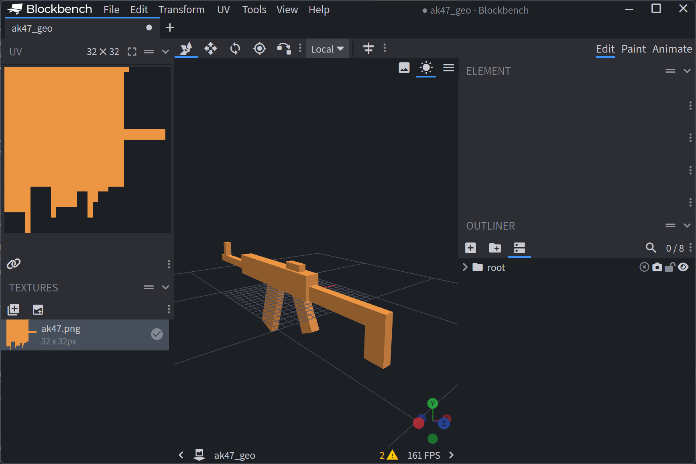
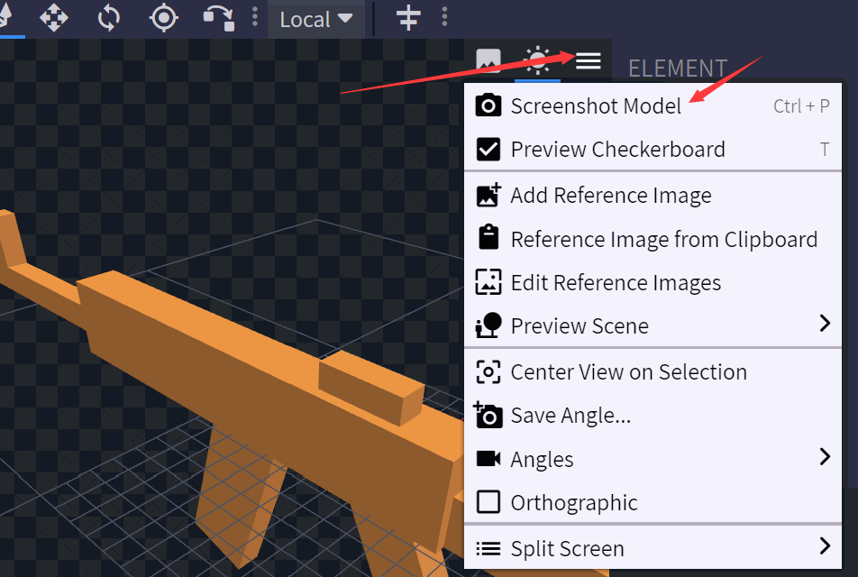

# 创建一把枪

我们将以 ak47 为示范，展示如何创建一把最简单的枪，并将其加入你的枪包。
### 创建枪械模型

我们先简单地创建一个模型用于教程。（注意，如果你需要创建一个精细且复杂的枪械模型，推荐你先阅读我们的[枪械模型构建工作流]()）   
首先，新建一个基岩版实体模型。   
   
然后，完成你的建模工作。    
    
最后，导出基岩版模型。   
    
也不要忘记保存材质文件。   
你可以借助 BlockBench 的 Screenshot Model 功能生成一个背包 2D 贴图。   
    
注意，此法生成的贴图是非矩形，你需要通过图片修改软件对其进行缩放或裁剪。
### 准备工作

确定你已经准备好了如下材料：   
模型文件: ak47_geo.json    
模型贴图: ak47.png    
背包 2D 贴图: ak47.png    
首先我们将枪械需要的资源文件放入相应的目录。在教程中，我们将使用 "tutorial" 作为枪包的命名空间。   
枪械模型应放入枪包的 models/ 目录下。我们可以创建一个子目录 models/gun/ 对枪械模型进行分类。并将模型文件放在此目录下。   
贴图文件应放入枪包的 textures/ 目录下。同理，我们创建一个子目录 textures/gun/ 对枪械贴图进行归类。在此目录下分别创建 uv 和 slot 文件夹，用于分别储存模型贴图和背包 2D 贴图。我们将模型贴图置于 textures/gun/uv/ 目录下，背包 2D 贴图置于 textures/gun/slot/ 目录下。   
如果你按照如上步骤操作，最后你将会得到如下的目录视图: 
```
tutorial
├─ textures
│  └─ gun
│     ├─ uv
│     │  └─ ak47.png
│     └─ slot
│        └─ ak47.png
└─ models
   └─ gun
      └─ ak47_geo.json
```
### 创建枪械数据文件

枪械定义文件应置于 guns/data/ 目录下。此文件用于定义枪械的各项属性，如伤害、弹容、射速等。接下来我们为 ak47 创建一个最基本的数据文件。   
创建文件 guns/data/ak47_data.json   
``` json
{
  // 指定枪械弹药，此处我们使用默认枪包中的 7.62x39mm 步枪弹。
  "ammo": "tac:762x39",
  // 弹容
  "ammo_amount": 30,
  // 枪栓类型。此处我们先按照 ak47 的类型填入 closed_bolt，以后再进行详细解释。
  "bolt": "closed_bolt",
  // 每分钟射出弹药量，最大不应超过 1200
  "rpm": 600,
  // 子弹实体属性
  "bullet": {
    // 寿命，单位秒
    "life": 10,
    // 伤害
    "damage": 6,
    // 速度 m/s
    "speed": 400,
    // 重力
    "gravity": 0,
    // 击退效果
    "knockback": 0,
    // 飞行阻力
    "friction": 0.01,
    // 是否点燃目标
    "ignite": false,
    // 穿透实体的最大数量
    "pierce": 2
    // 爆炸参数，用于 rpg 等爆炸性武器，如果没有填写，则弹头不会爆炸
    //"explosion": {
    //  "radius": 5
    //}
  },
  // 换弹参数
  "reload": {
    // 此处先填入 magazine，详细含义在以后解释。
    "type": "magazine",
    // 弹匣供弹完成时间，到达此时间点，服务端就更新枪内子弹数量
    // 通常对应着动画当中弹匣插入的瞬间。
    "feed": {
      // 空仓换弹
      "empty": 2.25,
      // 战术换弹
      "tactical": 1.55
    },
    // 弹匣供弹总时长（秒），到达此时间点，枪械才可以进行开火、检视等行为。
    // 通常对应着动画当中枪械回到原位的瞬间。
    "cooldown": {
      // 空仓换弹
      "empty": 2.6,
      // 战术换弹
      "tactical": 2.0
    }
  },
  // 枪械抬起的动作时长，单位秒。
  "draw_time": 0.35,
  // 收枪的动作时长，单位秒。
  "put_away_time": 0.4,
  // 瞄准时长，单位秒。
  "aim_time": 0.2,
  // 疾跑状态切换时长，单位秒。
  "sprint_time": 0.3,
  // 开火模式
  "fire_mode": [
    // 全自动
    "auto",
    // 半自动
    "semi"
  ],
  // 后坐力
  "recoil": {
    // 竖直方向偏转，会在两个数值之间取随机数
    // 遵循游戏内坐标系，上为正
    "pitch": [
      0.9,
      1.2
    ],
    // 水平方向偏转，会在两个数值之间取随机数
    // 遵循游戏内坐标系，右为正
    "yaw": [
      -0.5,
      0.5
    ]
  },
  // 不准确度
  "inaccuracy": {
    // 站立射击散布
    "stand": 0,
    // 移动射击散布
    "move": 0,
    // 潜行射击散布
    "sneak": 0,
    // 趴下射击散布
    "lie": 0,
    // 瞄准射击时散布
    "aim": 0
  }
}
```
### 创建枪械效果文件

枪械效果文件应置于 guns/display/ 目录下。此文件用于定义枪械的展示效果，如模型、贴图、动画等。接下来我们为 ak47 创建一个最基本的效果文件。   
创建文件 guns/display/ak47_display.json   
``` json
{
    // 使用我们放入的模型文件：models/gun/ak47_geo.json。注意，不需要包含文件后缀，也不要包含开头的 "models/"。
    "model": "tutorial:gun/ak47_geo",
    // 使用我们放入的模型贴图：textures/gun/uv/ak47.png。注意，不需要包含文件后缀，也不要包含开头的 "textures/"。
    "texture": "tutorial:gun/uv/ak47",
    // 使用我们放入的背包 2D 贴图：textures/gun/slot/ak47.png。注意，不需要包含文件后缀，也不要包含开头的 "textures/"。
    "slot": "tutorial:gun/slot/ak47",
    // 第三人称持枪动画，直接填入default
    "third_person_animation": "default",
}
```

### 创建枪械定义文件

枪械定义文件应置于 guns/index/ 目录下。此文件用于定义枪械物品，并索引到数据文件和效果文件。需要注意的是，此文件的名称即为你的枪械物品的id，是枪械物品的唯一标识符。接下来我们为 ak47 创建一个最基本的定义文件。   
创建文件 guns/index/ak47.json   
``` json
{
    // 枪械的显示名称，支持使用语言文件定义。
    "name": "tutorial.gun.ak47.name",
    // 枪械效果文件，对应 guns/display/ak47_display.json，其中前缀"guns/display/"和后缀".json"不需要包含。
    "display": "tutorial:ak47_display",
    // 枪械参数文件，对应 guns/data/ak47_data.json，其中前缀"guns/data/"和后缀".json"不需要包含。
    "data": "tutorial:ak47_data",
    // 创造栏标签页类别，直接用默认枪包定义的 rifle (步枪0
    "type": "rifle"
}
```
