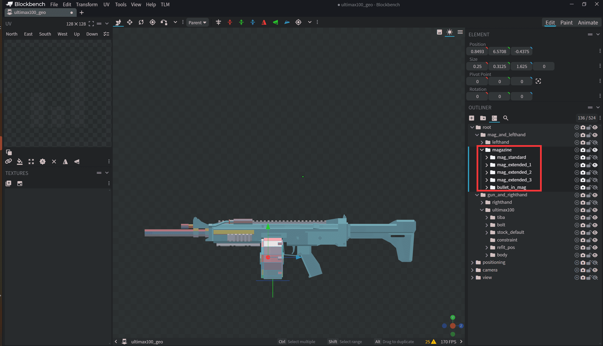
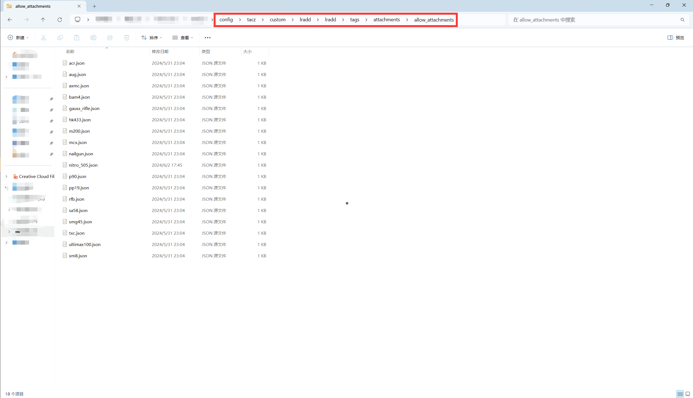

# 枪械改装支持
本篇教程内容作者: Lesraisins-伯爵   
[[toc]]

## 受配件影响的枪械模型分组

>在枪械模型中，如果一个分组被命名为以下名称之一，它将会被配件影响。

**默认配件**：xxx_default  
在不安装任何配件时渲染的配件模型，其中 xxx 替换为具体的配件类型：scope、grip、stock、muzzle、laser、extended_mag  
**默认机瞄**：sight  
在不安装任何瞄具下渲染的机瞄配件  
**默认护木与战术护木**: handguard_default/handguard_tactical  
在不安装握把配件时渲染: handguard_default  
在安装任意握把配件时渲染: handguard_tactical  
**镜桥**：mount  
在安装任意瞄具后渲染的镜桥   

## 设置定位组
### 装配界面摄像机定位组
>在游戏内持枪按【Z】打开装配界面


以下是所有的装配界面中枪械模型的摄像机定位组。你可以在 blockbench 为它们添加摄像机用于预览。

**总览**：refit_view  
**枪口**：refit_muzzle_view  
**枪托**：refit_stock_view  
**瞄具**：refit_scope_view  
**弹匣**：refit_extended_mag_view    
**握把**：refit_grip_view  
**镭射**：refit_laser_view  


### 模型定位组
>为使枪械配件能在枪械上正确的位置渲染，我们需要在枪械的模型中为它们添加定位组

1. 选择你需要的定位组，在合适的分组子目录下创建它们，确保它们能够受到枪械动画的影响。以下是支持的配件定位组的名称

   **枪口**：muzzle_pos  
   **镭射**：laser_pos  
   **瞄具**：scope_pos  
   **枪托**：stock_pos  
   **握把**：grip_pos   

2. 移动配件定位组到枪械对应的位置，下图以**瞄具scope_pos**为例。一般来说，我们需要将定位组放在导轨的接触面上。


### 弹匣、扩容弹匣

如果你需要使用扩容弹匣，你**必须**创建一个 **magazine** 分组，然后将普通弹匣和扩容弹匣分组全部置入其中，否则弹匣不会正常渲染。  

普通弹匣模型分组的名称应该被改为：**mag_standard**。  

扩容弹匣模型从 1 级 到 3级 分别应该被命名为：**mag_extended_1** ~ **mag_extended_3**。  



## 开启配件槽
打开枪械数据文件 namespace/gun/data/xxx_data.json

新增以下代码，选择并填写该枪械所支持的配件。
``` json
  // 开放的配件槽。未指定的槽位默认关闭。全部配件槽类型有:
  // scope, stock, muzzle, grip, laser, extended_mag
  "allow_attachment_types": [
    "scope",
    "stock",
    "muzzle",
    "grip",
    "laser",
    "extended_mag"
  ]
```

若武器支持扩容弹匣，则需添加以下代码规定不同等级的扩容弹匣所包含的弹药总数
``` json
  // 扩容弹夹弹药总数
  "extended_mag_ammo_amount": [
    45,
    70,
    100
  ]
```

## 更改配件TAG
>目前 tacz 使用了一套 tag 系统规定武器所支持的配件

### 使用通用配件
1. 在枪包**命名空间目录**下新建文件夹 tags/attachments/allow_attachments
2. 在该文件夹下创建文件 '{your_gun_name}.json' ( ak47.json for example )

3. 打开文件并在其中填写所支持的配件类型
``` json
[
    "#tacz:scope",
    "#tacz:muzzle",
    "#tacz:extended_mag",
    "#tacz:stock",
    "#tacz:grip",
    "#tacz:laser"
]
```
>以 '#' 开头的条目将会被视为 tag。tacz 使用的 tag 系统与原版类似，可以在 tag 中包含其他 tag。如果这么做，前者将被视为包含后者所包含的所有内容。

### 指定特定配件
1. 打开 tags/attachments/allow_attachments 中枪械对应的 tag 文件。
2. 直接指定配件 id。如下图，直接指定了默认枪包中的 SRO Dot 。
``` json
[
    "tacz:sro_dot"
]
```

### 创建自定义配件TAG

> 在 tags/ 文件夹下的任何 JSON 文件都将被视为 tag 被加载

1. 在 tags/attachments/ 文件夹下新建文件 '{tag_name}.json' (例如：my_grips.json)
2. 向 tag 文件中添加条目。注意，只能将**配件 id** 或者 tags/attachments/ 下的其他 tag 作为条目。
3. 在其他地方使用这个 tag。如果你的命名空间为 abc，那么位于 tags/attachments/ 文件夹下的 def.json 的全称是：abc:def。

### 扩展已经存在的TAG

以 #tacz:scope 为例。

1. 在枪包**根目录**下建立对应的命名空间文件夹，此例中为 tacz。
2. 在新建的命名空间下创建 tags 文件夹。
3. 在完全相同的路径下放一个同名 tag 文件，此例中为：tacz/tags/attachments/scope.json
4. 直接把需要扩展的条目加入其中。tacz 读取 tag 时，会自动收集所有同路径同名的 tag 文件中罗列的条目，而不是覆盖。
